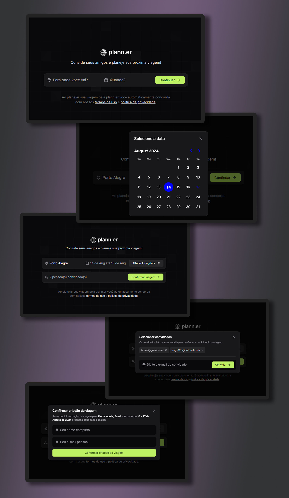

# planner-nlw

<h1 align="center"> Plann.er  </h1>

Projeto desenvolvido com a finalidade de estudar tecnologias Typescript, React e Tailwind.

 

  

## 🚀 Tecnologias

Esse projeto foi desenvolvido com as seguintes tecnologias:

- Tailwind
- Typescript
- React
- Git e Github
- Figma

## 💻 Projeto

Em razão da NLW Journey, promovida pela empresa Rocketseat, foi possível desenvolver o primeiro contato com React, Tailwind e Typescript, através do Vite.js, proporcionando estudo de novas tecnologias.
O encontro, que se deu por três dias, permitiu conhecer novas ferramentas de desenvolvimento front-end, acarretando numa agilidade de criações.

## ☝️ Desenvolvimento

Através do Vite.js, o React e Typescript foram responsáveis pela estruturação e composição do projeto. Utilizadas ferramentas como virtual DOM, componentes e react router. Da mesma forma, o primeiro contato com Tailwind se mostrou eficaz, na medida que a tecnologia agiliza o desenvolvimento front-end.